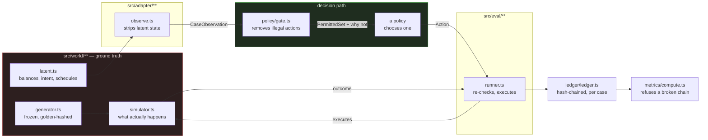
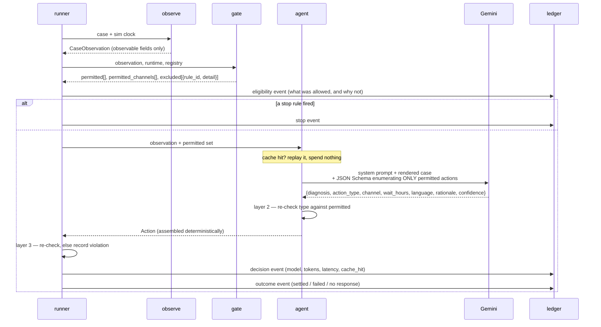

# Architecture

How a failed invoice becomes a decision, and what stops that decision from being
one it should not have been.

## The loop



The red box is ground truth. **`src/agent/**`, `src/policy/**` and
`src/domain/**` may never import from it, and `tests/boundary.test.ts` fails the
build if they do.** The agent cannot cheat because it cannot reach the answer.

`src/eval/**` may import it — the harness has to run the world — which is why
the harness is not where decisions are made.

## Four policies share one path

Every policy goes through the same gate, the same runner, the same ledger. That
is what makes the comparison mean anything.

| policy | decides by | sees ground truth |
|---|---|---|
| `do-nothing` | never acting | no |
| `naive-retry` | a fixed schedule | no |
| `static-policy` | tuned deterministic rules | no |
| `agent` | an LLM, within the permitted set | no |
| `oracle` | searching for the best achievable play | **yes** |

The oracle exists to produce the **ceiling**. It is not a competitor — it is the
denominator. If any observation-only policy ever beats it, the oracle's search
was incomplete, every "percent of recoverable" downstream is inflated, and
`npm run eval` **throws** rather than publishing the higher number.

## One decision, end to end



## Three layers between the model and the world

1. **The response schema is rebuilt per call** (`agent/schema.ts`) and
   enumerates only the actions the gate permits at that instant. A forbidden
   action is *undecodable*, not discouraged.
2. **The agent re-checks** the returned type against the permitted set
   (`agent/agent.ts:256`), in case the API ever returns something off-schema.
3. **The runner checks again** before executing and records a violation if it is
   wrong (`eval/runner.ts:313`). That is where the reported gate-rejection rate
   comes from.

Layer 3 alone would be sufficient for safety. Layers 1 and 2 exist so a failure
shows up as a *rejected decision* rather than a silently degraded result — and
so the rejection rate means something when it is reported. Across 12,738
recorded decisions it is **zero**.

## What the model is and is not given

**Given:** the invoice, the rail, the mandate, the payer's channels and consent
flags, the attempt and contact history, the permitted actions, and — the useful
part — every refused action with the rule id and detail that refused it.

**Not given:** any compliance rule. A test asserts that `CONTACT_HOURS`, `DND`,
`PREDEBIT_NOTICE` and `AFA_THRESHOLD` never appear in the system prompt. Telling
the model "never contact outside 9am–7pm" would imply the rule depends on the
model reading it, which is exactly the arrangement this design avoids. Rules are
enforced structurally; the prompt describes judgement.

**Cannot construct:** a refund, a discount, a mandate increase, a voice call, or
a third-party contact. Those are not restricted — they do not exist in the
action union, and a test asserts no action type contains those words.

## The audit trail

Per case, not global — each case's chain is independent, which is what lets the
runner process a wake-wave concurrently without the chain becoming
order-dependent.

```
event N.hash = sha256(canonicalJson({ ...event, prev_hash: event N-1.hash }))
```

`ts_wall` is deliberately **outside** the hash. A re-run at the same seed
reproduces every hash and every number exactly, while the files differ byte for
byte — because each record carries the real clock at which it was written, which
is reporting metadata, not part of what the chain attests to.

`npm run eval` verifies every chain before printing a single metric. A tampered
or truncated trail is worse than no trail, because it still looks credible.

## Determinism

Three things could make a run irreproducible, and each is closed:

- **Randomness** is a seeded RNG addressed by `(seed, entity_id, purpose)`, so
  the same case draws the same values regardless of evaluation order.
- **Concurrency**: the agent's decisions are network round-trips, so a wake-wave
  runs them in parallel. Issuer health — the one observed field other cases can
  change — is snapshotted for the whole wave before any decision in it runs, so
  the observation is a function of the seed and the simulated clock alone.
  `tests/concurrency.test.ts` asserts identical observation hashes at
  concurrency 1 and 8. (It did not always: see C-020.)
- **The model** is sampled once per distinct situation and that sample is
  committed. The honest description is "recorded decisions", and `--no-cache`
  re-queries live for anyone who wants to check they are representative.

## Where the money numbers come from

```
at_risk            face value of every failed invoice
  − structurally unrecoverable   (hard classes, by the taxonomy)
  = the most anyone could get

ceiling            what the ORACLE achieved by searching ground truth
recovery_vs_ceiling = recovered / ceiling      ← the headline denominator
```

Face value is never the denominator. It includes money no policy could have
recovered, so measuring against it flatters everything.

Intervention cost (gateway fees, message costs, handoffs) is mechanical and
subtracted into `net_recovered_paise`. **Goodwill cost is an unfalsifiable
assumption** and is reported beside the headline, never folded into it — folding
it in would be the easiest way to make the agent look good by construction,
since the agent contacts less than the naive baseline by design.

Model inference cost is reported in **USD beside the rupee figures**, priced per
model, and never converted — converting needs an exchange rate, and an unstated
assumption inside a headline number is how a wrong figure looks right.

## File map

| path | holds |
|---|---|
| `src/world/**` | ground truth: generator, simulator, latent state, oracle |
| `src/adapter/observe.ts` | the strip — what a merchant can actually see |
| `src/policy/gate.ts` | the rules engine; produces the permitted set and every refusal |
| `src/policy/static_policy.ts` | the tuned deterministic baseline |
| `src/agent/**` | prompt, per-call schema, provider, decision cache, the agent |
| `src/eval/runner.ts` | the discrete-event loop, enforcement, execution |
| `src/ledger/ledger.ts` | hash-chained append and verification |
| `src/metrics/compute.ts` | metrics, bootstrap intervals, paired comparison |
| `config/*.yaml` | rules registry, failure taxonomy, mixes, costs — all versioned |
| `.cache/llm/` | 12,738 recorded model decisions, keyed and committed |
